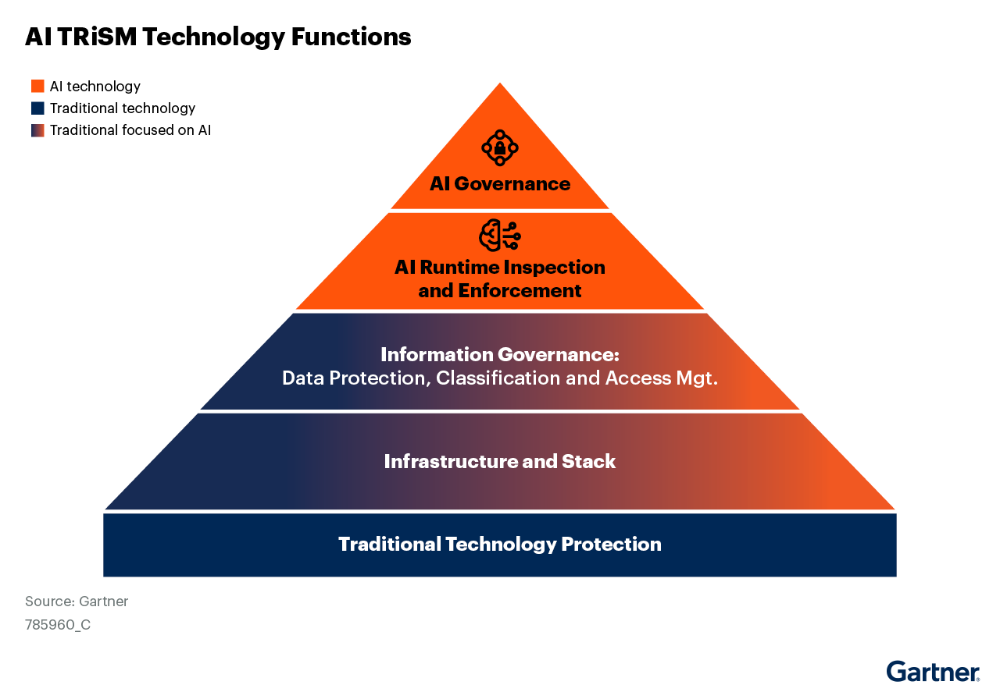

# Market Guide for AI Trust, Risk and Security Management by Gartner, Licensed for Distribution

> 18 February 2025 - ID G00785960 - 57 min read
>
> By Avivah Litan, Max Goss, Sumit Agarwal, Jeremy D'Hoinne, Andrew Bales, Bart Willemsen

The AI trust, risk and security management market comprises four layers of technical capabilities that enforce AI governance policies. The top two layers, new to AI, are consolidating into a distinct market segment. AI leaders should use this guide to understand TRiSM and discover sample vendors.

---

## Table of Content

- [Market Guide for AI Trust, Risk and Security Management by Gartner, Licensed for Distribution](#market-guide-for-ai-trust-risk-and-security-management-by-gartner-licensed-for-distribution)
  - [Table of Content](#table-of-content)
  - [Overview](#overview)
    - [Key Findings](#key-findings)
    - [Recommendations](#recommendations)
    - [Strategic Planning Assumptions](#strategic-planning-assumptions)
  - [Market Definition](#market-definition)
    - [Mandatory Features](#mandatory-features)
  - [Market Description](#market-description)
    - [What the AI TRiSM Market Guide Does Not Include](#what-the-ai-trism-market-guide-does-not-include)
  - [Market Direction](#market-direction)
    - [Trend 1: AI TRiSM Teams Take Shape](#trend-1-ai-trism-teams-take-shape)
    - [Trend 2: Unified AI Runtime Inspection and Enforcement Systems](#trend-2-unified-ai-runtime-inspection-and-enforcement-systems)
    - [Trend 3: AI Hosting Providers Expand TRiSM Services](#trend-3-ai-hosting-providers-expand-trism-services)
    - [Trend 4: AI TRiSM Market Consolidation](#trend-4-ai-trism-market-consolidation)
  - [Market Analysis](#market-analysis)
    - [AI Governance](#ai-governance)
      - [Table 1: AI Governance Technology Functions (List-fied)](#table-1-ai-governance-technology-functions-list-fied)
    - [AI Runtime Inspection and Enforcement](#ai-runtime-inspection-and-enforcement)
      - [Table 2: AI Runtime Inspection and Enforcement Functions (List-fied)](#table-2-ai-runtime-inspection-and-enforcement-functions-list-fied)
    - [Market Analysis - Information Governance](#market-analysis---information-governance)
    - [Infrastructure and Stack](#infrastructure-and-stack)
  - [Representative Vendors](#representative-vendors)
    - [Vendor Selection](#vendor-selection)
    - [AI Governance and Runtime Inspection and Enforcement](#ai-governance-and-runtime-inspection-and-enforcement)
      - [Table 3: Representative Vendors: AI Governance and Runtime Inspection and Enforcement](#table-3-representative-vendors-ai-governance-and-runtime-inspection-and-enforcement)
    - [Representative Vendors - Information Governance](#representative-vendors---information-governance)
      - [Table 4: Representative Vendors: Information Governance](#table-4-representative-vendors-information-governance)
  - [Market Recommendations](#market-recommendations)
  - [Evidence](#evidence)
    - [Evidence 1: AI Hacks vs. AI Trust and Safety Events](#evidence-1-ai-hacks-vs-ai-trust-and-safety-events)
    - [Evidence 2: A Short History of ChatGPT: How We Got to Where We Are Today by Forbes](#evidence-2-a-short-history-of-chatgpt-how-we-got-to-where-we-are-today-by-forbes)
    - [Evidence 3: 2024 Gartner AI Mandates for the Enterprise Survey](#evidence-3-2024-gartner-ai-mandates-for-the-enterprise-survey)
    - [Evidence 4: 2024 Gartner Data Security in the Age of AI Advancements Survey](#evidence-4-2024-gartner-data-security-in-the-age-of-ai-advancements-survey)
  - [Notes](#notes)
    - [Note 1: Frontier Model Provider Definition](#note-1-frontier-model-provider-definition)
    - [Note 2: Unified Runtime Inspection and Enforcement System](#note-2-unified-runtime-inspection-and-enforcement-system)
    - [Note 3: AI Governance Technology Capabilities](#note-3-ai-governance-technology-capabilities)
    - [Note 4: AI Runtime Inspection and Enforcement Layer Components](#note-4-ai-runtime-inspection-and-enforcement-layer-components)
    - [Note 5: Information Governance Survey Data](#note-5-information-governance-survey-data)
    - [Note 6: Privacy-Enhancing Technology](#note-6-privacy-enhancing-technology)
    - [Note 7: Key Information Governance Functions](#note-7-key-information-governance-functions)

---

## Overview

### Key Findings

- Enterprises face multiple AI risks and are most concerned with data compromise, third-party risks, and inaccurate or unwanted outputs:
  - Malicious hacks against enterprise AI are still uncommon, while incidents of unconstrained harmful chatbots are well documented and internal oversharing data compromises are prevalent.
- Layered AI TRiSM measures apply to all types of AI, from embedded AI to homegrown, agentic AI systems, and complement traditional technology protection measures:
  - New AI governance and runtime enforcement functions are coalescing to form a distinct, unique segment of the TRiSM market.
- User demand for GenAI TRiSM solutions is steadily increasing, and providers of all sizes are competing for this new enterprise business:
  - Some vendors specialize in supporting security and risk mitigation, others in supporting ethical or safe practices and regulatory compliance. No single vendor or solution addresses all segments and aspects of AI threats and risks at this time.
- AI trust, risk and security issues surface organizational silo issues, pushing teams to realign to solve problems that cross departmental boundaries.

### Recommendations

AI leaders and individuals responsible for AI controls must work with stakeholders to establish AI governance policies and assign responsibilities for managing AI TRiSM technology that supports policy execution. Once organized, they must:

- Discover and inventory all AI used in the organization.
- Revisit and implement data classification, protection and access management across all enterprise information that can potentially be utilized by AI.
- Evaluate and implement layered AI TRiSM technology to continuously enforce policies across all AI use cases.
- Stay flexible and ensure independence from any single AI model provider as more advanced and cost-effective AI models and tooling become available.
- Monitor the vendor landscape frequently for expected consolidation and emerging TRiSM outsourced services that reduce the burden of system integration and maintenance.

### Strategic Planning Assumptions

- Through 2026, at least 80% of unauthorized AI transactions will be caused by internal violations of enterprise policies concerning information oversharing, unacceptable use or misguided AI behavior rather than malicious attacks.
- By 2027, AI TRiSM as a service will emerge as a viable outsourced service option for enterprises that do not have the resources to implement their own AI TRiSM services.
- By 2028, consolidated and dedicated information governance teams consisting of representatives from data and analytics, digital workplace, and security and compliance will exist in 25% of large organizations, up from less than 1% in 2023.

---

## Market Definition

Gartner defines the AI trust, risk and security management (TRiSM) market as comprising four layers of technical capabilities that support enterprise policies for all AI use cases. These policies help assure AI governance, trustworthiness, fairness, safety, reliability, security, privacy and data protection. The top two layers — AI governance and AI runtime inspection and enforcement — are new to AI and are, in part, consolidating into a distinct market segment, while the bottom two layers represent traditional technology focused on AI.

AI brings new trust, risk and security management challenges that conventional controls do not address. Enterprises are most concerned with data compromise, third-party risks, and inaccurate or unwanted outputs, and need to ensure enterprise AI behavior and actions align with enterprise intent.

Enterprises must further retain independence from any single AI model or hosting provider to ensure scalability, flexibility, cost control and trust, as AI markets rapidly mature and change. Enterprises need to be able to pick and choose which AI tools and models best fit their use cases from a performance, cost and risk point of view, and cannot simply rely on vendors adding AI functionality to existing enterprise applications to meet all the organization’s AI requirements.

Enterprise AI TRiSM functions should be portable across back-end hosting providers. Enterprises should supplement, where they can, their own TRiSM services with TRiSM functions provided by hosting and frontier model providers to support a robust, layered control framework.

The AI TRiSM market has been steadily growing and evolving with solutions that address these issues. User demand for TRiSM solutions is increasing as more AI projects are operationalized, and providers of all sizes are competing for this new enterprise business.

AI TRiSM solutions give enterprises visibility into all of the AI that is accessed and used in their networks. They also enable organizations to more safely use AI, ensure AI actions align with organizational intent, keep AI systems secure from malicious actors, and assure confidential data and intellectual property are properly protected. AI TRiSM solutions also help support compliance with AI regulations, safety and security standards, and internal controls.

AI TRiSM measures apply to all types of AI, from embedded AI to homegrown, agentic AI systems, and complement traditional technology protection measures. New AI governance and runtime enforcement functions are coalescing to form a distinct, unique segment of the TRiSM market.

### Mandatory Features

Mandatory features include:

- AI catalog: An inventory of AI entities used in the organization, such as models, agents and applications in various configurations, ranging from embedded AI in off-the-shelf, third-party applications to bring-your-own AI, to retrieval-augmented generation systems, to first-party models.
- AI data mapping: Data used to train or fine-tune AI models, provide context for user queries in a RAG system, or feed AI agentic systems.
- Continuous assurances and evaluation of performance, reliability, security, or safety expectations and metrics that are used for baselines.
- Assurances and evaluations are applied predeployment, postdeployment (out of band).
- Runtime inspection and enforcement: Applied to models, applications and agent interactions to support transactional alignment with organizational governance policies. Applicable connections, processes, communications, inputs and outputs are inspected for violations of policies and expected behavior. Anomalies are highlighted and either blocked, autoremediated or forwarded to humans or incident response systems for investigation, triage, response and applicable remediation.

---

## Market Description

AI TRiSM technology is quickly evolving to keep pace with rapid AI advancements and users’ increasing interest in deploying it safely and securely. [Evidence 1](#evidence-1-ai-hacks-vs-ai-trust-and-safety-events)

Figure 1 shows the four layers of AI TRiSM, which sit atop a fifth bottom layer consisting of traditional technology controls, such as network, endpoint and cloud security solutions.

> **Figure 1: AI TRiSM Technology Functions**
>
> 

The top two layers of the AI TRiSM technology framework — AI governance and runtime solutions — are consolidating, in part, to form a distinctly new market segment required to manage AI risks and threats. Specifically, combining governance capabilities for AI inventory and continuous evaluations with runtime inspection and enforcement functions supports runtime analyses of AI interactions, anchored to a continuously risk scored AI inventory. This new segment will continue to be supported by enterprise solutions contained in the bottom two layers of AI TRiSM which represent traditional technology focused on AI information and workloads.

No single vendor or solution addresses all aspects of AI risks and threats at this time. Some vendors specialize in supporting security and risk mitigation, while others specialize in supporting ethical or safe practices and regulatory compliance. Even within the AI governance layer, some vendors are more focused on a wide array of governance functions, while others only provide as much as needed to effectively provide runtime controls. As noted above, these controls usually consist of AI inventory and continuous evaluation.

> The AI TRiSM market is distinguished by its independence from frontier model provider solutions that also support trust risk and security management (see [Note 1](#note-1-frontier-model-provider-definition)).
>
> Enterprises must retain independence from any single AI model or hosting provider to ensure scalability, flexibility, cost control and trust, as AI markets rapidly mature and change.

Enterprises need to be able to pick and choose which AI tools and models best fit their use cases from a performance, cost and risk point of view. They cannot simply rely on vendors adding AI functionality to existing enterprise applications to meet all the organization’s AI requirements. Enterprise AI TRiSM functions should be portable across back-end hosting providers. At the same time, enterprises should supplement, where they can, their own TRiSM services with TRiSM functions provided by hosting and frontier model providers to support a robust, layered control framework.

Over time, we expect comprehensive AI TRiSM as a service to emerge as a category of outsourced services focused on the needs of small and midsize enterprises. These services will work for a wide range of AI implementation types (see Slide 8 in [AI Technology Sandwich: A Conceptual Framework for Executing AI](https://www.gartner.com/en/documents/5837447) by Gartner).

### What the AI TRiSM Market Guide Does Not Include

This guide does not include TRiSM solutions available from frontier model hosting providers. These companies typically provide AI filtering for socially unsafe interactions that involve violence, hatred, self-harm or inappropriate sexual interactions. Most model hosting providers support private enterprise tenants, encryption of enterprise data in transit, and data processing agreements that keep enterprises in control of their data. They are also starting to support the detection of commonly identifiable security violations, such as prompt injections.

Model hosting and frontier model providers do not typically have access to all enterprise data and cannot provide comprehensive information governance that is critical for reliable and secure AI adoption. Further, frontier model providers are not in the business of customizing AI TRiSM policy engines for enterprises’ specific acceptable use policies. What they can do, however, is provide tooling for enterprises to customize and deploy those policy enforcers on their own.

Using AI can lead to existential societal risks, but the AI TRiSM Market Guide does not include solutions that directly mitigate those risks, as enterprises currently have no control over them. Frontier model providers, AI researchers and regulators are responsible for measures that mitigate existential AI risks.

Finally, AI TRiSM is not part of the security or fraud management market that uses AI to detect malicious incidents, such as fraud, deepfakes, theft or data breaches, nor is it part of the market that leverages GenAI to make security or fraud operations more efficient.

---

## Market Direction

Four distinct trends are shaping the AI TRiSM market and its expected future (see Figure 2). These trends have been pushed to the surface since ChatGPT democratized access to GenAI and highlighted the urgent need to control enterprise use of AI. [Evidence 2](#evidence-2-a-short-history-of-chatgpt-how-we-got-to-where-we-are-today-by-forbes) Until that time, most enterprise AI development:

- Was used for first-party models developed internally by data science teams.
- Required high levels of data science and AI engineering skills to work with.

Thus, TRiSM took a backseat in most nonregulated industries.

> **Figure 2: Four Key Trends Shape AI TRiSM Market**
>
> 

### Trend 1: AI TRiSM Teams Take Shape

AI requires new cross-enterprise team processes and tools for effective runtime deployments. This ensures all interested parties work together in achieving unified AI outcomes that meet their different requirements. Gartner is witnessing four emerging organizational trends that will naturally lead to TRiSM oversight and operations teams over the next three years (see Figure 3):

- Security and risk management functions coalesce and integrate with relevant IT software engineering and quality assurance teams, and shift left to AI engineering to manage AI TRiSM controls.
- AI centralized or hybrid teams emerge and manage all aspects of AI, including AI TRiSM controls.
- Information governance fractures the surface, causing a renewed immediate need for a unified approach across different organizations for protecting information used by AI.
- Legal and compliance staff take demand that regulatory and legal requirements are satisfied in enterprise AI applications.

> **Figure 3: Teams Must Align With New AI Processes and Domains**
>
> 

Gartner expects AI TRiSM oversight and operations teams will report to the manager responsible for enterprise AI innovation, development and operations. Meanwhile, budget authority for AI privacy, security and risk initiatives typically sits with the office of the CTO or CIO, according to an enterprise AI survey Gartner conducted in 2024.[Evidence 3](#evidence-3-2024-gartner-ai-mandates-for-the-enterprise-survey)

### Trend 2: Unified AI Runtime Inspection and Enforcement Systems

Consistent signaling, low latency, single-pass processing and unified runtime control systems are needed to effectively process runtime inspection of AI events and enforce enterprise policies. Otherwise, siloed inspection and policy enforcement systems for the same events at runtime will result in conflicting analyses and resolutions (see Figure 4 and [Note 2](#note-2-unified-runtime-inspection-and-enforcement-system) for elaboration on unified AI runtime inspection and enforcement system).

> **Figure 4: Unified Runtime Inspection and Enforcement**
>
> 

It is important to:

- Execute runtime policy engines (consisting of rules and AI models) simultaneously — e.g., separate policy engines that score data compromise risk, bias risk, legal risk and security threats.
- Merge their results into a common blended risk score that guides future enterprise actions and remediations for the suspect AI interactions.

Organizations must identify the best equipped team to manage the unified runtime inspection and enforcement system, whether it is a new AI team in AI engineering, an expanded IT team or an expanded security and risk team. Regardless of who owns the unified runtime detection and enforcement system, incident response and remediation for suspect transactions that are not automatically blocked or remediated should be passed on to units and systems best equipped to handle them.

For example, under most scenarios, security events detected in the unified inspection and enforcement system would be sent to the organization’s security information and event management (SIEM) team (or outsourced managed security service provider, as appropriate) for necessary followups. AI event triage will then require multiple escalation queues, based on the type of anomalies or violations encountered:

- Acceptable use violations and hallucinations would be sent to the unit best equipped to manage them — e.g., an AI incident response team.
- Prompt injections and more traditional attacks would be sent to the security and risk team.

New playbooks to triage and escalate nonsecurity AI violations, such as legal or compliance issues will be necessary.

### Trend 3: AI Hosting Providers Expand TRiSM Services

Frontier model providers and other AI hosting providers are continually expanding the TRiSM services they offer enterprises as a competitive strategy for gaining more of their business. A few have already introduced tooling that enterprises can use to support their own specific acceptable use policies. Most hosting providers have implemented guardrails against use of their models for violence, self-harm, sexual content and hatred. Many have implemented tooling to detect copyright infringements and known runtime security threats, such as prompt injections.

AI TRiSM will always be a shared responsibility across users and model providers, the level of which depends on the configuration of the AI services, whether they represent IaaS, PaaS or SaaS services. Organizations who host and manage their own models are solely responsible for all risk mitigations.

### Trend 4: AI TRiSM Market Consolidation

**Integration of AI governance with AI runtime inspection and enforcement**: This has already been achieved, in part, by several vendors in this Market Guide, and we expect this trend to accelerate in 2025 and beyond. Typically, vendors providing AI runtime inspection and enforcement also provide two AI governance functions:

- AI catalogs (e.g., inventory)
- Continuous assurance and evaluations

Integrating these two governance functions with runtime controls provides the foundation for real-time analyses and policy enforcement for all enterprise AI interactions, and gives a complete view of AI risks and threats.

**Land and expand strategy from multiple types of vendors**: The consolidation of AI governance and runtime inspection and enforcement will integrate into services offered by established large software, security or networking vendors seeking to grow customer wallet share by supporting users in their AI journey. For instance:

- Gartner saw signs of this trend in 2024, when Cisco acquired Robust Intelligence, an early startup TRiSM vendor.
- We also witnessed cloud based network security vendors like Zscaler and Palo Alto Networks expand their capabilities into AI TRiSM.

Further:

- Some regulatory, compliance/fairness and trust and safety oriented solutions will consolidate with established governance risk and compliance (GRC) systems, many of whom are already adding modules for AI governance.
- Some AI runtime inspection and enforcement solutions will consolidate with SASE, SSE and cloud security vendors like Zscaler and Wiz, and SIEM and SOAR vendors like Exabeam or Cisco (Splunk).
- Vendors who provide outsourcing services for security and risk functions will expand to offer AI TRiSM services, targeted largely at small and midsize organizations.
- Vendors who provide enterprise AI management platforms that support an abstraction layer for AI life cycles, will increasingly integrate TRiSM capabilities into their platforms. For example, AI vendors such as [Airia](https://airia.com/) and [Backplain](https://backplain.com/) already integrate TRiSM capabilities while helping users determine which back end model is the most suitable and cost-effective option for a given use case. Eventually, these AI management vendors will be acquired by larger software firms.

**Information governance layer consolidation**: Vendors providing data security posture management (DSPM), data security and data loss prevention (DLP) systems will continue to expand to incorporate AI-centric functionality. In particular:

- DSPM vendors will incorporate dynamic data classification and permissioning at AI runtime.
- DLP vendors will expand their functionality to support context based inspection of AI sessions and interactions, and use AI policy engines to enforce acceptable use and access controls. DLP vendors will also broaden their products to support responses and inbound information, (and not just transaction inputs and outbound information as they do today).
- Data security platform vendors will integrate security of both structured and unstructured information in their offerings.

---

## Market Analysis

As illustrated in Figure 1, the AI TRiSM market consists of four functional technology layers. The top two are new to AI; the bottom two are traditional technology measures focused on AI:

- AI governance
- AI runtime inspection and enforcement
- Information governance
- Infrastructure and stack

Multiple capabilities reside within each functional layer. Here, we look at each layer in detail and outline those capabilities.

### AI Governance

Enterprise AI governance involves several stakeholders across technical and functional teams — data science, AI engineering, legal, privacy, risk and compliance, human resources, ethics, security, audit, procurement and business teams. AI governance provides a framework to manage an organization’s AI assets, instill confidence in AI performance and ensure business outcomes.

AI governance, with similar organizational pillars and focus as other governance initiatives, is driven through people and process initiatives with technology as an enabler. _This section is focused on AI governance technology._

AI governance technology provides a unified view of the health of enterprise. AI governance technology straddles three core frameworks — responsible AI, protected and secure AI, and AI-ready data — and provides the connective tissue across the various AI implementations within the enterprise:

- A **responsible AI framework** includes the principles of safety, security, accountability, transparency, fairness and ethics.
- The **protected and secure AI framework** includes the principles of acceptable use enforcement, alignment of AI with user intentions, and protection against malicious actors.
- An **AI-ready data framework** ensures access to trustworthy and protected (through access management and data classification) data for AI solutions.

In addition, AI governance technology supports assurance and audit practices for AI implementations:

- **AI assurance** involves various processes and activities to verify that models, agents and applications are performing according to the business, legal (e.g., contractual), regulatory (e.g., EU AI Act, General Data Protection Regulation \[GDPR\]) and compliance (e.g., NIST Artificial Intelligence Risk Management Framework (NIST AI RMF), ISO/IEC 42001) obligations. AI governance technology supports linkage of evidence and artifacts related to human assurance activities.
- Most **AI audit** requirements include system and validation traceability to ensure compliance with organizational policies and regulatory requirements.

All of this requires several core AI governance technology capabilities with extensions that support integration with operationalization platforms, most notably AI runtime inspection and enforcement solutions. See [Table 1](#table-1-ai-governance-technology-functions-list-fied) and [Note 3](#note-3-ai-governance-technology-capabilities) for elaboration on AI governance capabilities.

#### Table 1: AI Governance Technology Functions (List-fied)

Governance: Pre- or Postdeployment Supporting Activities

**AI visibility and traceability**:

- Catalog: Discovery, inventory and risk scoring of all AI used in organization
- Automated (partly) documentation: Bill of materials, model cards, artifacts, regulatory reports, explainability
- Audit trails: Audits of all state changes to AI artifacts
- Maps: Maps of AI integration with human and other system processes and their configurations; complete life cycle
- Ownership: Owner of artifacts and lineage
- Data: Mapping of data to AI usage, lineage
- Risks, regulations and controls: Validations, risk assessments, content libraries, reports

**Workflow (internal and third party)**:

- Approvals of new AI; exceptions
- Attestations of use
- Communications with third-party providers:
  - RFI
  - Responses
  - Compliance
  - Controls

**Continuous assurances and evaluation (internally developed and third party)**:

- AI security testing: Red teaming and scanning for all entities (models, applications, agents)
- Risk and trust control validation:
  - Bias
  - Leakage
  - Trust
  - Use-case alignment
- Posture management
- Compliance reporting

> Source: Gartner (February 2025)

### AI Runtime Inspection and Enforcement

AI runtime inspection and enforcement applies to models, applications and agent interactions and supports transactional alignment with organizational governance policies. Applicable connections, processes, communications, inputs and outputs are inspected for violations of policies and expected behavior. Anomalies are highlighted and either blocked, autoremediated or forwarded to humans or incident response systems for investigation, triage, response and applicable remediation.

Gartner is seeing much similarity in runtime inspection and enforcement controls applied across AI entities such as models, applications and agents. Best-of-breed runtime inspection systems will offer a modular solution architecture where users can apply applicable detections and enforcements to any AI entity — for example, model, application or agent — based on the AI use case.

Figure 5 depicts a sample enterprise integration architecture for runtime inspection and enforcement for homegrown apps and agents. This diagram would look different for other types of AI, such as embedded AI in off-the-shelf applications.

> **Figure 5: Sample Enterprise Integration Architecture for Homegrown Apps and Agents; Runtime**
>
> 

[Table 2](#table-2-ai-runtime-inspection-and-enforcement-functions-list-fied) shows the different measures applied for different AI entities; these measures are further described in [Note 4](#note-4-ai-runtime-inspection-and-enforcement-layer-components).

#### Table 2: AI Runtime Inspection and Enforcement Functions (List-fied)

Runtime inspection and enforcement

**AI models**:

- Model monitoring
- Detect anomalous activities and security events; block if possible and autoremediate
- Data protection
- Responsible AI filtering
- Compliance with internal and external controls

**AI Applications**:

- Context-based access control and dynamic contextual data classification
- Content anomaly detection for input and output risks (safety and enterprise acceptable use); autoblock if possible
- AI runtime defense (malicious and hacker attacks); autoblock if possible
- Selective data obfuscation and redaction
- Compliance with internal and external controls

**AI agents**:

- Align agent activity with agent intentions
- Detect and flag anomalous activities and security events
- Automatically block, when possible, anomalies and security events
- Autoremediate, when possible, anomalies and security events
- Compliance with internal and external controls

> Source: Gartner (February 2025)

### Market Analysis - Information Governance

In the context of AI TRiSM, information governance is concerned with classifying, protecting, securing and managing data throughout its life cycle. Mature information governance controls are critical for:

- Ensuring that AI only has access to relevant and correctly permissioned information.
- Securing the organization’s sensitive information.
- Attempting to comply with relevant AI regulations, such as the EU AI Act.

For more, see [Adopt 5 Key Privacy Lessons When Preparing for AI Regulations](https://www.gartner.com/en/documents/5641991) by Gartner.

Oversharing due to inappropriate access controls and data leakage risks caused by poor information governance are not new problems. However, when GenAI tools are embedded into enterprise applications or use RAG to find organizational information, they can expose overshared data much faster and to a larger audience, and illuminate data life cycle challenges. Failing to take appropriate measures to identify and govern sensitive data throughout the organization’s data estate will exacerbate such challenges, introducing unnecessary data risks and potentially culminating in a widespread data breach. This is a particular problem for well-known horizontal AI products like Microsoft 365 Copilot, Gemini for Workspace and ChatGPT Enterprise (if integrated into productivity platforms). Unstructured data in productivity platforms like Microsoft 365 and Google Workspace has been historically poorly managed, which becomes a significant issue when AI models deployed in the infrastructure have default, widespread access to organizational data.

To guard against oversharing concerns when using GenAI and other AI tools, organizations must improve information governance holistically. The challenges are twofold:

- Most organizations and vendors have tried to address this from specific siloes — e.g., security, data protection, identity, or compliance — rather than improving information governance by bringing together the siloed groups for a consolidated view and coordination actions.
- Information governance often becomes an afterthought, and can be perpetually delayed in deference to other projects that are deemed more pressing (see [Note 5](#note-5-information-governance-survey-data)). [Evidence 4](#evidence-4-2024-gartner-data-security-in-the-age-of-ai-advancements-survey)

> For many organizations, weak information governance is emerging as the major obstacle to wider GenAI rollouts and presents an opportunity for third-party vendors specializing in this space.

To improve information governance, organizations need to embrace a multidisciplinary team consisting of stakeholders from various teams, including digital workplace, data and analytics (D\&A), data security, compliance, and identity and access management (IAM). Specifically, this multidisciplinary team must focus on:

- Bridging the gaps between the various representative teams to ensure that the organization’s security, usability, privacy and scale requirements can be met (see Figure 6). Do this by, for example, facilitating predeployment workshops that are not specific to any security discipline, but to the organization’s strategic business outcomes.
- Processing, classifying, protecting and securing sensitive information in accord with data purpose, organizational objectives, and business needs.
- Establishing data retention policies to manage redundant, obsolete or tertiary content (ROT).
- Switching to a policy of purpose-based access control (PBAC) to cut down on “permissions sprawl.”
- Building scalable information architectures in productivity platforms (like Microsoft 365 and Google Workspace) to make the above simple to manage and easy for users to understand.

> **Figure 6: Multidisciplinary Approach Required for Information Governance**
>
> 

Currently, this technology layer is still fragmented with vendors that usually focus on one or two of the required components for comprehensive information governance. For example:

- DSPM, DLP and DAG vendors focus on data security.
- Identity governance vendors focus on permission management.
- Compliance vendors focus on retention and data life cycle.

Privacy-enhancing technologies (PET) are a collection of tools that help protect data in use, such as during model training, fine tuning, inference on obfuscated data, or federated model execution across entities that might not want to share data while information exchange remains a deliberate purpose. PETs can be applied in several layers of the AI TRiSM stack, such as at the compute level (for example, confidential computing), in information governance (for example, using consistently and robustly altered data across life cycle stages using synthetic data or forms of homomorphic encryption such as **Enveil**), in performance monitoring (for example, using synthetic data), or obfuscation in inference, RAG and fine-tuning (for example, **Protopia**) (see [Note 6](#note-6-privacy-enhancing-technology) on PET).

As such, while many products can be used to reduce information governance risk, you will be unlikely to find a single product that offers a comprehensive solution. See [Note 7](#note-7-key-information-governance-functions) for description of key information governance functions.

### Infrastructure and Stack

Infrastructure and stack refers to the hardware and software environments that support AI workloads, special-purpose tools and libraries used for development and maintenance of AI applications, the data processing layer and the deployment environment including the network infrastructure. Gartner is observing solutions in this layer being applied to AI workloads, thereby fortifying the protection of AI data and processes. Solutions in this category include API key management and confidential computing to protect workloads in trusted execution environments.

---

## Representative Vendors

The vendors listed in this Market Guide do not imply an exhaustive list. This section is intended to provide more understanding of the market and its offerings.

### Vendor Selection

Vendors are diverse and fragmented in their AI TRiSM capabilities. Inspect the products under consideration for the detailed functionalities included in each of the core AI TRiSM capabilities listed in the Market Analysis section.

### AI Governance and Runtime Inspection and Enforcement

AI governance and AI runtime inspection and enforcement solutions are new to AI and constitute the top two layers of the AI TRiSM technology framework. These two layers of AI are integrating in part to form a distinct new segment of the AI TRiSM market.

At this time, vendors providing AI governance and runtime controls differ considerably in their capabilities, and Gartner observes two primary categories of vendors in this space (with some vendors crossing both categories in part):

- **Policy governance**: These are vendors who have primarily and historically targeted GRC buyers by providing full AI documentation, regulatory compliance monitoring and a wide range of AI governance functions as defined in Table 1 above. Many of these vendors have also branched into runtime controls that validate enterprise policies especially around compliance are being enforced.
- **Operational governance**: These are vendors who target buyers responsible for ensuring a wide range of risk and security threats are mitigated during AI operations. These vendors offer a narrower range of AI governance functions (i.e., AI inventory and continuous assurances/evaluations) and support runtime analyses of AI interactions anchored to a continuously risk scored AI inventory.

[Table 3](#table-3-representative-vendors-ai-governance-and-runtime-inspection-and-enforcement) lists sample vendors that fall into both of these categories, where the lines are starting to blur as vendors expand their feature set to satisfy user demands.

#### Table 3: Representative Vendors: AI Governance and Runtime Inspection and Enforcement

| Company | Product | Headquarters | Year founded | Differentiating capability |
| :--- | :--- | :--- | :--- | :--- |
| [ActiveFence](https://www.activefence.com/) | AI Guardrails by ActiveFence | New York, NY | 2018 | Used to build and deploy guardrails for AI applications. Provides policy-based, customizable protection across any AI model combination. Focus on visibility, safety evaluation, real-time protection and incident management. |
| [Aim Security](https://www.aim.security/) | Aim AI Security Platform | Tel Aviv, Israel | 2022 | Operational governance and visibility for multiple AI Assets (models, agents, pipelines, ML flows, notebooks, libraries), risk assessment and automated red teaming. Runtime monitoring to prevent prompt injections and jailbreaks, covering runtime data, AI app protection (RAG vulnerabilities and agentic workflows), and integrating with DSPMs to highlight sensitive data used to train AI assets. |
| [AIShield (Powered by Bosch)](https://www.boschaishield.com/) | AISpectra — AI Security for Model Development    Guardian — AI Firewall for Runtime Security | Koramangala, Bengaluru, India | 2022 | Operational governance and runtime controls, including AI inventory management and continuous evaluations, automated red teaming, real-time intrusion detection and vulnerability assessments. Runtime analysis of AI interactions anchored to a risk-scored inventory, and integrated with DevSecOps and SIEM tools. |
| [Airia](https://airia.com/) | AI Gateway    Enterprise Security    Observability and Audit | Atlanta, GA | 2023 | Airia provides runtime inspection and enforcement for data leakage, prompt injections and other security violations and hallucination detection. It also supports compliance with detailed audit logs, and customizable security policies. |
| [Apex](https://www.apexhq.ai/) | Apex AI Security Platform | Palo Alto, CA | 2023 | Operational governance including AI inventory, and continuous evaluations. Agentless solution, detection and response across all enterprise AI activity. |
| [AppSOC](https://www.appsoc.com/) | AppSOC AI | San Jose, CA | 2021 | Operational governance and runtime controls using tools such as posture management, AI discovery, red teaming and model testing, AI supply chain security. Also provides responsible AI filtering, ML-driven DLP, and content anomaly detection. |
| [CalypsoAI](https://calypsoai.com/) | Inference Defend    Inference Red Team | Dublin, Ireland, and    New York, NY | 2018 | CalypsoAI Inference Defend provides real-time inference-layer security by inspecting and enforcing AI interactions and continuously adapts defenses based on model performance, user behavior and threat intelligence while enabling customizable controls and compliance with evolving regulations.    CalypsoAI Inference Red Team delivers automated, scalable assessments that run real-world adversarial attacks to proactively identify vulnerabilities and create a risk-scored AI inventory, combining agentic warfare with signature attacks and operational testing. |
| [Cisco (Robust Intelligence)](https://www.robustintelligence.com/) | Cisco AI Defense | San Jose, CA | 1984 | Cisco AI Defense protects development and deployment of enterprise applications, as well as employee usage of third-party AI apps. This product builds on algorithmic vulnerability testing and runtime guardrails acquired in the purchase of Robust Intelligence and leverages Cisco’s network-layer visibility and security enforcement to safeguard AI assets and workloads across distributed environments. |
| [Collibra](https://www.collibra.com/) | | New York, NY | 2008 | Collibra delivers governance capabilities, including model documentation, explainability, compliance functions, and equally invests in AI reliability and compliance. It also delivers runtime metrics and enforcement mechanisms across leading AI/ML platforms. |
| [Coralogix (Aporia)](https://coralogix.com/) | AI Observability | Tel Aviv, Israel | 2019 | Leverages multiple specialized small language models (SLMs) to provide targeted evaluations based on the type of anomalies or behaviors. Each type of policy in the catalog might rely on its own SLM, providing real-time controls at low latency, enabling operational governance through policy enforcement and monitoring. |
| [Cranium](https://cranium.ai/) | | Short Hills, NJ | 2022 | AI operational governance platform enables security, third party, compliance and trust across the AI supply chain, with unique AI trust and safety hubs where organizations share information.    Visibility into AI/ML code by scanning all repositories, identifying, and labeling relevant directories, and prioritizing results by size and recent activity for focused attention with a short time to value. |
| [Credo AI](https://www.credo.ai/) | Credo AI | San Francisco, CA | 2020 | Credo AI provides a dedicated GRC platform for AI governance, with out-of-the-box workflows and governance content to support organizations aligning their development and use of AI with regulations, standards, and best practices. The Credo AI platform integrates with enterprise’s AI infrastructure to create a centralized AI inventory and provides automated AI risk assessment and continuous risk monitoring to identify and mitigate critical risks and compliance issues. |
| [Databricks](https://www.databricks.com/) | Databricks Unity Catalog | San Francisco, CA | 2013 | Databricks delivers unified security and governance across the entire data and AI life cycle with Unity Catalog, enabling organizations to govern structured and unstructured data, ML models, and AI functions in one place. Unity Catalog extends governance to both proprietary and open-source models with centralized access control, auditing, ML quality monitoring — including fairness, bias detection and AI appropriateness — lineage tracking and model discovery, and automates sensitive data classification, enforces fine-grained security at the row and column level. |
| [DataRobot](https://www.datarobot.com/) | DataRobot Enterprise AI Suite | Boston, MA | 2012 | DataRobot’s AI governance framework automates model management across generative and predictive AI, and extends its governance to on-premises, edge, remote devices and cloud. DataRobot streamlines compliance with regulations like the EU AI Act and HIPAA through automated documentation, customizable reports, and built-in safety and compliance analyses, that is augmented as needed with real-time and streaming moderations for predictive and generative inference, plus deep monitoring tools for local and remote deployments. |
| [Daxa](https://www.daxa.ai/) | Pebblo | Cupertino, CA | 2021 | Daxa combines provisioning-time AI data context with runtime data access controls. It enables both AI governance and security while leveraging an open-source approach that is developer-first. |
| [Fairly AI](https://www.fairly.ai/) | Fairly AI Governance, Risk and Compliance Management Platform for Enterprise | Ontario, Canada | 2020 | Fairly AI Governance Risk and Compliance Management Platform for Enterprise uses a multi-agent-as-a-judge assessment framework that employs a “mixture of experts” model trained with qualitative and quantitative risk and compliance data to help detect, manage and mitigate AI risk. |
| [HiddenLayer](https://hiddenlayer.com/) | AISec Platform | Austin, TX | 2022 | HiddenLayer focuses on securing AI and machine learning models, providing specialized threat detection, model protection and adversarial attack mitigation that traditional cybersecurity solutions overlook. It integrates into existing AI pipelines to provide security without compromising performance. |
| [Holistic AI](https://www.holisticai.com/) | AI Governance Platform    AI Audits    AI Safeguard    AI Tracker | San Jose, CA | 2020 | Holistic AI’s software enables organizations to manage AI risks by ensuring transparency, fairness, and accountability in AI systems. They provide a wide range of tools for governance, security, and runtime analysis to help minimize financial, legal, and reputational risk. |
| [IBM](https://www.ibm.com/products/watsonx-governance) | IBM watsonx.governance | Armonk, NY | 1911 | Vendor-agnostic: Govern AI even if built and deployed with third-party vendors which includes governance throughout life cycle — from concept to development and at runtime.    Comprehensive capabilities spanning ML and GenAI and addresses needs of multiple persona: AI observability and monitoring, risk management spanning AI risk and regulatory compliance, as well as AI security through integration with IBM’s AI security and other vendors. |
| [Knostic](https://www.knostic.ai/) | | Tel Aviv, Israel | 2023 | Knostic defines, captures and manages topic-level need-to-know for various roles within an organization that is different from traditional data-centric and information-centric controls. Knostic’s need-to-know rules can be used to find overshared content, enforce per-user/per-topic guardrails, alert on need-to-know violations in logged interactions, and ensure that agentic-LLMs operate within the bounds of their user’s need-to-know. |
| [Lakera](https://www.lakera.ai/) | Lakera AI Security Platform | San Francisco, CA | 2021 | The Lakera AI Security Platform delivers real-time visibility and control to block threats and govern agents. Lakera’s AI-first approach provides AI threat detection and maximizes agent performance. |
| [Lasso Security](https://www.lasso.security/) | Lasso for Application    Lasso for Employees    Lasso for Developers    Lasso for Model Protection | Tel Aviv, Israel | 2023 | Lasso Security is a GenAI security platform that enhances an organization’s security posture by autonomously testing LLM apps, monitoring all GenAI interactions, detecting risks in real-time and enabling advanced guardrails. With Lasso for applications and employees, organizations can continuously test and protect GenAI models, apps, agents and chatbot usage while maintaining compliance and security. |
| [LatticeFlow AI](https://latticeflow.ai/) | | Zürich, Switzerland | 2020 | LatticeFlow maps the intersection of internal and external AI governance frameworks, regulations and AI systems to allow risk to be modeled in an enterprise context.    LatticeFlow continuously gathers technical and contextual evidence about a use case and connects it to AI controls, providing an empirical basis for interpretation and change detection. |
| [ModelOp](https://www.modelop.com/) | ModelOp Center | Chicago, IL | 2016 | ModelOp’s AI governance technology provides end-to-end model life cycle management for all AI initiatives, including GenAI, in-house, third-party and embedded AI systems. By leveraging automation to enforce compliance, integrating with existing IT and AI investments, ModelOp supports scalable, effective governance across business units and teams. |
| [Monitaur](https://www.monitaur.ai/) | Govern and Automate | Boston, MA | 2019 | Monitaur unifies various standards and regulations into a comprehensive common control library and each Monitaur control defines a risk, maps to a model development stage, and prescribes what work should be done by both model builders and risk stakeholders to mitigate the risk. Within the validation offerings, Monitaur also introduces synthetic data in certain situations to further extend the range of tests and simulated scenarios for adversarial and robust stress testing assessments. |
| [Noma Security](https://noma.security/) | AI Midsize Security Platform Including:    AI Supply Chain Security    AI Governance and Security Posture Management    AI Runtime Protection | Tel Aviv, Israel | 2023 | Comprehensive coverage of AI governance across the entire life cycle, including AI supply chain security (including Jupyter notebooks, model registries), AI runtime protection, AI red team and AI infrastructure assessment.    The single pane of glass view and numerous integrations are used to improve the accuracy of runtime detection and the clarity of the dashboards. |
| [OneTrust](https://www.onetrust.com/) | Data and AI Governance Solution | Atlanta, GA | 2016 | OneTrust governs data and AI projects with GenAI policies across data systems. The Data and AI Governance solution prepares data for AI by automating metadata discovery, translating written policies into executable data policies and dynamic controls, and embedding governance throughout the AI life cycle — from design to deployment. |
| [Operant AI](https://www.operant.ai/) | AI Gatekeeper | San Francisco, CA | 2020 | Operant secures AI workloads in runtime with discovery, detection and active defense capabilities for AI models, AI applications, AI APIs and AI agents. Operant offers advanced AI data protection capabilities, including in-line blocking, autoredaction, and data obfuscation of critical and sensitive data. |
| [Palo Alto Networks](https://www.paloaltonetworks.com/) | AI Runtime Security    AI Access Security    AI Security Posture Management | Santa Clara, CA | 2005 | AI Runtime Security discovers, protects and monitors every component in the AI ecosystem (apps, models, agents and data) from AI-specific threats and prevents data leakage from AI models, apps and agents — safeguarding them from misuse and attacks.    AI Access Security provides comprehensive visibility into a company’s GenAI use with an up-to-date catalog of over 1K apps. Its context-aware AI detections prevent sensitive data leakage to risky third-party LLMs. |
| [Pillar Security](https://www.pillar.security/) | Pillar Unified AI Security Platform | Tel Aviv, Israel | 2023 | The Pillar AI Security platform delivers comprehensive security and governance for AI models, applications, and agents across all runtime and development phases — regardless of model, version or location. It integrates to provide continuous inventory discovery, tailored adversarial testing, dynamic runtime defenses, data classification and immutable logging of every interaction including those from users, datasets, pipelines, models and more. |
| [Prompt Security](https://www.prompt.security/) | Prompt for Employees    Prompt for AI Code Assistants    Prompt for Homegrown GenAI Applications | New York, NY | 2023 | Comprehensive visibility, runtime monitoring and policy enforcement, covering AI adoption by employees, including enterprise applications like Microsoft 365 Copilot and AI code assistants, with specialized capabilities (e.g., code scanning), and is also available for custom-built GenAI applications. Policies include content moderation, data privacy and security, leveraging a combination of small language models, heuristics and other techniques to minimize latency and offer on-the-fly redaction of sensitive or inappropriate content. |
| [Protect AI](https://protectai.com/) | Layer    Guardian    Radar    Recon | Seattle, WA | 2022 | Protect AI end-to-end AI security platform enabling customers to address security needs across model development, application testing, runtime security and governance.    Customers can leverage best-in-class scanners off the shelf and connect to existing MLOps and security tooling, while mapping to common risk and security frameworks like Open Worldwide Application Security Project (OWASP), NIST and MITRE all within one platform. |
| [S2E](https://solutions2enterprises.com/en/) | Galene.AI    Generative Shield | Milano, Lombardia, Italy | 2008 | Generative Shield provides AI governance features like catalogs, automated documentation, audit trails and testing, along with AI runtime inspection and enforcement for AI applications and agents, including intention alignment, anomaly and security detection, and automated blocking/remediation, all with a focus on European regulations, such as the EU AI Act and GDPR. Available as a SaaS platform or on-premises, it integrates as a proxy between apps/agents and major LLM inference services and servers via market-standard APIs. |
| [Securiti](https://securiti.ai/) | Securiti Data Command Center | San Jose, CA | 2018 | Securiti Data Command Center provides comprehensive security and governance of AI systems, including securing shadow AI, building safe enterprise AI apps and securing AI embedded in SaaS applications. Leveraging a unique knowledge graph, Securiti uses granular context to enforce security controls aligned with Gartner’s AI TRiSM framework, OWASP Top 10 for LLMs, and compliance regulations like the EU AI Act and NSIT Artificial Intelligence Risk Management Framework (NIST AI RMF). |
| [TrojAI](https://www.troj.ai/) | TrojAI Defend    TrojAI Detect | New Brunswick, Canada | 2019 | TrojAI provides a platform for both AI governance and runtime inspection of models through pentesting the model as well as real-time AI runtime protection. The AI governance product informs the AI runtime protection through increased context obtained through AI pentesting, delivering more accuracy and effective controls in securing AI model behavior. |
| [WitnessAI](https://witness.ai/) | Witness AI Secure AI Enablement Platform | San Mateo, CA | 2023 | Integrating with common tools, WitnessAI detects shadow AI, classifies conversations and provides real-time protection to users of AI applications including Copilots. WitnessAI provides robust guardrails for data protection and harmful responses while scaling to protect models and chatbots from jail breaks and unwanted behavior. |
| [Zenity](https://www.zenity.io/) | Zenity | New York, NY | 2021 | Zenity governs and secures AI agents from buildtime to runtime, providing a defense-in-depth approach that leverages deep agent behavioral monitoring and intent breaking detection capabilities for visibility and proactive risk mitigation. Zenity goes beyond just inputs and outputs to view everything the agent is doing and combines business-logic-driven AI Security Posture Management (AISPM) with real-time AI Detection and Response (AIDR) to mitigate risks, ensure compliance, and maximize SOC and AppSec efficiency. |
| [Zerotrusted.ai](https://www.zerotrusted.ai/) | AI Firewall | Kissimmee, FL | 2022 | Its runtime protection uses model ensemble and LLM-as-a-Judge to improve trustworthiness and reliability in LLM outputs, with minimized latency. |

> Source: Gartner (February 2025)

### Representative Vendors - Information Governance

Information governance vendors included in the table below represent sample vendors who focus their product efforts on protecting information for AI usage. As noted, sample PET vendors are listed in the referenced research in Table 4.

See [Emerging Tech Impact Radar: Edge Artificial Intelligence](https://www.gartner.com/en/documents/5119031) by Gartner for its section on privacy-enhancing technologies and sample vendors.

#### Table 4: Representative Vendors: Information Governance

| Company | Product | Headquarters | Year founded | Differentiating capability |
| :--- | :--- | :--- | :--- | :--- |
| [AvePoint](https://www.avepoint.com/) | The AvePoint Confidence Platform | Jersey City, NJ | 2001 | The AvePoint Confidence Platform is the single pane of glass to ensure AI readiness for users and content, including policies for data governance, data security and information management. The platform also strives to prevent burnout within security teams by engaging business owners directly to resolve risk and create a strong data foundation, in addition to benchmarking activity against peers to measure adoption grounded in reality. |
| [BigID](https://bigid.com/) | BigID Next | New York, NY | 2016 | BigID provides information governance teams with controls for data discovery, data classification, data protection and access controls to address information governance risks posed by AI usage. |
| [Concentric AI](https://concentric.ai/) | Concentric AI Semantic Intelligence | San Mateo, CA | 2018 | Concentric AI can discover and classify structured and unstructured data in both cloud and on-premises data sources. Concentric AI applies controls to ensure that data is not inappropriately shared through AI tools. |
| [Harmonic Security](https://www.harmonic.security/) | Harmonic Protect | San Francisco, CA | 2023 | Harmonic has developed small language models (SLMs) to address the risks posed by GenAI adoption. Information governance teams can build policies based on these models to prevent data loss to GenAI applications. |
| [Infotechtion](https://infotechtion.com/) | Infotechtion ARM (i-ARM) | London, U.K. | 2019 | Infotechtion extends the Microsoft Purview capabilities to data in on-premises and cloud data stores. Information governance teams can use Infotechtion for data discovery, security, governance and life cycle management. |
| [Lumeus](https://lumeus.ai/) | Lumeus | San Jose, CA | 2021 | Lumeus.ai uses both SLMs and LLMs to secure access to and usage of sensitive data by users and applications. |
| [Privya](https://privya.ai/) | AI Security | Tel Aviv, Israel | 2021 | Privya’s platform provides deep model inspection and leverages a unique dynamic Security Graph for automated lineage tracking, root-cause analysis, and comprehensive AI application protection. |
| [Proofpoint (Normalyze)](https://normalyze.ai/) | Proofpoint, Including DLP and Data Security Posture Management | Sunnyvale, CA | 2002 | Proofpoint data security safeguards sensitive data by preventing its upload, paste and prompt entry to AI tools like OpenAI (ChatGPT) and restricting enterprise copilot’s access to shared files through automated permissions adjustments. It also maps and monitors AI data pipelines across multicloud environments, enforcing data access policies and ensuring consistent data classification and risk management for large language models. |
| [Rencore](https://rencore.com/en/) | Rencore Governance | Munich, Germany | 2015 | Rencore Governance enables strong data governance and security and oversees the governance of AI instances, agents, and AI-enabled applications. IT teams gain visibility into their organization’s AI and collaboration assets, allowing them to enforce policies on creation, management and life cycle through manual controls, automation or end-user self-service while monitoring risks and costs. |
| [Rubrik](https://www.rubrik.com/) | Rubrik DSPM    Rubrik Annapurna | Palo Alto, CA | 2014 | Rubrik DSPM helps organizations understand where they have overprovisioned access to sensitive or confidential data before enabling copilot or other GenAI apps to prevent accidental exposure of sensitive data to unauthorized users without requiring installation of additional agents or scanners.    Rubrik Annapurna allows organizations to build their own GenAI apps leveraging the Rubrik backup data as source with built in data discovery, sensitive data filtering, and source data user permission preservation — leading to a low-cost and secure way to build GenAI apps for any use case |
| [Sentra](https://www.sentra.io/) | Cloud-Native Data Security Platform (DSP) | Tel Aviv, Israel/New York, NY | 2021 | Sentra DSP automates the discovery and classification of sensitive data within training datasets, protects against unauthorized access with comprehensive security measures, and continuously monitors security posture to identify and remediate vulnerabilities and new threats. |
| [Skyflow](https://www.skyflow.com/) | Skyflow | Palo Alto, CA | 2019 | Skyflow goes beyond redaction and anonymization to secure use of sensitive data across training, inference, and agentic workflows, across structured, unstructured, and multilingual datasets by using rehydration and role-based controls. It also leverages patented polymorphic encryption and tokenization. |
| [Syskit](https://www.syskit.com/) | Syskit Point | Cambridge, U.K. | 2009 | AI readiness requires continuous governance across the entire workspace life cycle, from creation to end-of-life, encompassing self-service, provisioning, storage, life cycle management, and reporting. Syskit Point addresses this with policy enforcement, automated monitoring, and real-time recommendations, empowering not only admins but also workspace owners to mitigate sprawl and oversharing at scale. |
| [Varonis](https://www.varonis.com/) | Varonis Unified Data Security Platform | New York, NY | 2005 | The Varonis Unified Data Security Platform enables organizations to secure sensitive data, detect abnormal behavior, and prevent attacks focused on AI tools, like copilots and agents, and AI models. |

> Source: Gartner (February 2025)

---

## Market Recommendations

AI leaders must work with stakeholders across the organization to manage AI trust, risk and security. They should establish an organizational structure for creating and updating AI governance policies and for evaluating and implementing AI TRiSM technologies that enable and enforce these policies. This will help the organization systematically ensure safer, and more reliable, trustworthy and secure AI use.

Once organized, AI leaders and their business partners should:

- Discover and inventory all AI used in the organization, leveraging the capabilities of vendors who help with this, as defined in the AI governance section of this guide.
- Revisit and implement data classification, protection and access management across all enterprise information — both structured and unstructured — that can potentially be utilized by AI. This will necessitate collaboration across different teams involved in information governance.
- Work with legal and compliance experts to contractually define accountability and responsibility for unacceptable AI use or behavior in third-party embedded AI applications.
- Evaluate and implement layered AI TRiSM technology to continuously support and enforce policies across all AI entities in use. This includes enterprise-owned AI TRiSM services, along with controls offered by frontier model providers. Evaluate frontier model hosting provider capabilities from vendors such as Microsoft, OpenAI, Amazon Web Services (AWS), and Google and apply them where appropriate but do not solely rely on them:
  - Enterprises must have controls that enforce their own enterprise specific AI TRiSM policies and simultaneously maintain provider independence. This way enterprises can use the most effective hosted AI for their use cases, whether they are large language models, small language models, open source models or any other type of AI tooling.
  - Enterprises that don’t have sufficient resources to assemble these services on their own should rely more heavily on third party providers of embedded AI solutions for their TRiSM controls.
- Ensure independence from any single AI model provider to enable future flexibility as AI evolves and more advanced and cost-effective AI models become available. TRiSM services help support that independence.
- Monitor the vendor landscape continually for expected consolidation and for emerging TRiSM outsourced services that reduce the burden of system integration and maintenance.

---

## Evidence

### Evidence 1: AI Hacks vs. AI Trust and Safety Events

Gartner has not seen much evidence of direct hacks against AI other than in the case of nation state hacks that steal AI intellectual property, or against AI used in national security and sensitive government operations. This is bound to change as adoption and transaction volume accelerates. AI TRiSM providers report that they find many AI vulnerabilities in client environments that can potentially be exploited, but little evidence that they have been. Again, this will almost definitely change when AI adoption ramps up.

For example, threat intelligence provider IBM XForce reported that it didn’t see many hacks against AI and projected it won’t see any significant criminal activity against AI until the market reaches a 50% threshold: “X-Force analysis indicates that the establishment of AI market dominance will signal AI attack surface maturing. This analysis suggests that once a single AI technology approaches 50% market share, or when the market consolidates to three or less technologies, the cybercriminal ecosystem will be incentivized to invest in developing tools and attack paths targeting AI technologies." [IBM X-Force Threat Intelligence Index 2024](https://www.ibm.com/reports/threat-intelligence).

On the other hand, there have been numerous public reports of AI applications going off the rails, violating intellectual property rights, and creating unsafe and even harmful consequences for human users. For one of the latest most egregious examples see: [An AI Companion Suggested He Kill His Parents. Now His Mom Is Suing](https://www.washingtonpost.com/technology/2024/12/10/character-ai-lawsuit-teen-kill-parents-texas/). Much less egregious incidents are easily found in the public domain.

### Evidence 2: [A Short History of ChatGPT: How We Got to Where We Are Today](https://www.forbes.com/sites/bernardmarr/2023/05/19/a-short-history-of-chatgpt-how-we-got-to-where-we-are-today/) by Forbes

### Evidence 3: 2024 Gartner AI Mandates for the Enterprise Survey

This study was conducted to understand how AI and generative AI (GenAI) are being adopted by enterprises, focusing on areas such as AI strategy, data, governance, literacy, engineering, organization, portfolio and value, to assist clients in keeping pace with AI’s rapid evolution. The research was conducted online from October through December 2024 among 432 respondents from the U.S. (n = 181), the U.K. (n = 70), France (n = 50), Germany (n = 50), India (n = 51) and Japan (n = 30). Quotas were established for company sizes and for industries to ensure a good representation across the sample. Organizations were required to have deployed at least one AI use case in production. Respondents were screened for C-level executives (e.g., chief AI officer, chief data officer, chief data scientist, chief digital officer, chief information officer, chief operating officer, chief technology officer or equivalent) or roles above vice presidents. All respondents were required to have high involvement in at least one AI initiative. Disclaimer: The results of this survey do not represent global findings or the market as a whole, but reflect the sentiments of the respondents and companies surveyed.

### Evidence 4: 2024 Gartner Data Security in the Age of AI Advancements Survey

This survey sought to understand the practices that cybersecurity leaders should follow to better manage risks associated with data. The survey was conducted from June through August 2024. In total, 318 senior executives participated, who were involved in data security across organizations of different industries, geographies and sizes. This research was further substantiated and informed by in-depth practitioner interviews with over 40 chief information security officers (CISOs) to understand cybersecurity goals and challenges associated with data security, given the rapid rise in adoption of GenAI tools and technologies. Gartner used statistical analysis to measure and identify the most impactful data security practices for improving key cybersecurity outcomes. Disclaimer: The results of this survey do not represent global findings or the market as a whole, but reflect the sentiments of the respondents and companies surveyed.

---

## Notes

### Note 1: Frontier Model Provider Definition

A frontier model provider refers to a company that develops and operates the most advanced AI models that are pushing the boundaries of what AI can achieve — e.g., multimodal AI or artificial general intelligence. This includes companies, such as OpenAI, Google, Microsoft, Anthropic and others. The models they are developing or helping develop are much more powerful than the AI models currently on the market.

### Note 2: Unified Runtime Inspection and Enforcement System

Different units and participants will have different interests in the trust, risk and security of AI interactions. For example:

- The trust and safety personnel are interested in identifying safety issues so that customer-facing chatbots don’t lead to customer self-harming activities.
- Line-of-business units want to ensure customer-facing AI applications conform to policies they establish, so that for example customers are not offered discounts that do not exist.
- The security team is intent on blocking malicious code injected into agent traffic that hijacks enterprise assets for malevolent purposes.
- The information governance team seeks to block potential data compromise when accessed information is not properly classified or permissioned.
- The legal team wants to block transmission of enterprise intellectual property to external AI models and conversely they want to block receipt of others’ IP that the enterprise is not entitled to access.

In sum, the same AI transaction may be high risk with one lens but low risk with another so a unified single pass processing system is needed to make the decision to alert or block based on multiple considerations.

In the scenario above transactions that are not automatically blocked will be passed on to different incident and response teams if they exist. For example:

- Harmful customer chatbot interactions detected at runtime should be sent to a unit that knows how to respond to trust and safety issues.
- Security events should be forwarded to security incident response systems.
- Data compliance violations should be forwarded to information governance teams who can respond and remediate to prevent similar future violations.
- Legal and compliance issues should be sent to a compliance staff that can analyze the violation and respond accordingly.

### Note 3: AI Governance Technology Capabilities

AI visibility and traceability:

- **AI catalog**: The catalog provides a comprehensive inventory of all AI entities used in the organization, e.g., models, agents, applications in various configurations ranging from embedded AI in off-the-shelf third-party applications to bring your own AI to retrieval augmented generation (RAG) systems and to first party models. The catalog risk scores these entities, and provides a structured way to track and access them. The catalog also stores the metadata of the AI entities — for example a model card and its run time metrics. This enables discovery by business and technical users. The catalog is agnostic to the operationalization platform.
- **AI documentation**: This includes model cards, bill of materials and regulatory reports.
- **AI ownership**: The platform should identify the ownership of various artifacts and activities, for example, the model owner or risk assessment owner.
- **AI risk and regulations**: The usage of AI systems raises several risks and requires compliance with various industry and government regulations. The AI governance platform includes the risk assessment for the use-case artifacts (models, applications and agents), along with the constraints and requirements to confirm regulatory compliance. This may in the form of validations, documentation, or reports.
- **AI data mapping and lineage**: Data is used to train or fine-tune AI models. Data is also used to provide context for user queries in a RAG system, or to feed AI agent systems. AI governance technology functions should map data used by various AI entities and track the usage over time. It may interface with data governance platforms to include data lineage, classification, ownership and data observability information.
- **AI audit**: The AI use-case implementation involves several components, including data, prompts, models, applications and agents. The use-case output is used for decision making. The AI governance platform supports the audit of the complete life cycle through lineage, versioning and traceability.

Workflow:

- **Approvals**: All new AI systems need to be approved for specific usage. This may include reviews and approvals from AI governance boards, procurement teams, architecture review boards, security team and risk teams.
- **Attestation and validation**: New AI systems or updates may require an ongoing attestation and validation as part of the workflow for AI system implementation. The workflow includes internal and external AI along with third party embedded AI. Some of the examples are machine learning (ML) models developed internally, or external LLMs accessed through APIs integrated within a RAG solution or a conversational chatbot, or a third-party HR solution with embedded AI models.
- **Communication with third-party providers**: AI systems are not limited to internal development. Business function focused solutions or on-premises, from third-party system or solution providers involve providing a RFI, assessment of responses, compliance and controls requirements. Some AI governance systems are providing structured processes for communications between buyers and their suppliers. In theory, supplier responses can be shared across different customers, and validated when systems are deployed through systematic and continuous testing.

Continuous assurances and evaluation:

- **AI security testing**: Security testing of the various AI entities used to access, develop, run or maintain AI such as notebooks, endpoints, models, agents, applications, and pipelines. These tests aim to protect enterprise assets against adversarial attacks. Continuous automated testing and code scans are essential parts of a red teaming program for a trustworthy and secure AI implementation.
- **Risk and control validation**: This determines deviations or anomalies related to bias, leakage, trust and use-case alignment.
- **Posture management**: The metadata across the end-to-end life cycle and operations provide a consolidated view of the business requirements, design time metrics and runtime metrics. Integration with runtime inspection and enforcement systems can turn static posture management into real-time posture management.
- **Compliance reporting**: Internal and external reporting requirements to support compliance with various risk and regulatory frameworks.

### Note 4: AI Runtime Inspection and Enforcement Layer Components

TRiSM controls for **AI models** fall under the responsibility of model builders or owners. Organizations using a third-party model can implement some of these controls, treating the model as a third-party component:

- **Model monitoring**: Sitting between the application stack and the model, model monitoring inspects all inputs sent to the model and raw outputs of the models, before validation and modification by the application stack. This includes model outputs that become inputs to other models, so the chain of model events are monitored across models.
- **Anomalous activity and security event detection; block if possible and autoremediate**: Detect and flag anomalous activities and security events. Auto block high risk activities and events, when certain. Respond and autoremediate for similar future anomalous or security events so that the same issues do not reoccur.
- **Data protection**: At runtime, the scope of model data protection is to protect the model itself, primarily preventing retrieval of training data as well as protecting inference data at runtime.
- **Responsible AI filtering**: Ensures that the model outputs comply with model owner defined AI safety, ethics and fairness measures, and remains in scope for its intended use, avoiding harmful or toxic outputs.
- **Compliance**: Map model controls and deployment characteristics with global and local regulations requirements, often in the form of a compliance rate.

AI applications:

- **Runtime data protection**: Enforce least privilege access/role-based access control to ensure that retrieved content is limited to what the user of the application can legitimately access. Also performs dynamic (real-time) content classification so the access controls can be properly applied to data that is sent or retrieved by users or machine processes.
- **Content anomaly detection for inputs and outputs risks**:
  - Inputs: Detects anomalies in inputs as defined by enterprise policies for example to detect violations in acceptable use or in acceptable data inputs.
  - Outputs: detects anomalies in outputs to similarly support enterprise policies. This includes detection of:
    - Outputs that violate enterprise acceptable use policies
    - Hallucinations
    - Inaccurate, illegal, copyright-infringing and otherwise unwanted outputs that compromise enterprise decision making
- **AI runtime defense**: Detect malicious activities, such as prompt injections, exploitation of software component vulnerabilities to gain privileged access, or attempt to bypass existing guardrails (e.g., jailbreaks). Optionally can prevent inputs to be transmitted to the model, or block the response before it reaches the user, and supplement it with a warning message.
- **Intelligent data obfuscation and redaction**: Apply privacy enhancing technologies, such as data masking or data redaction automatically on input and outputs to preserve user and enterprise data privacy.
- **Compliance**: Monitor in real time applications inputs and outputs, and map them to global and local compliance requirements to detect potential compliance violations.

AI agents:

- **Agent alignment**: Ensure that the agent activities are in scope with agent intentions.
- **Anomaly detection**: Detects and flag anomalous agent activities and security events. Autoblock high risk activities and events, when certain.
- **Autoremediation**: Respond and autoremediate for similar future anomalous or security events so that the same issues do not reoccur.
- **Compliance**: Monitor in real time agent processes and activities inputs and map them to global and local compliance requirements to detect potential compliance violations.

### Note 5: Information Governance Survey Data

Recent Gartner survey data indicate that for some organizations, security teams lead many of the downstream objectives within information governance (like deciding on DLP technology for minimizing data loss), but have less responsibility for leading upstream efforts (like establishing data discovery and determining data classification schemas).¹ Specifically, 74% of survey participants indicate that security leads the decision making for DLP technology, but indicate that security is less likely to lead the function in other critical information governance efforts, like undertaking data discovery or determining their organization’s data classification schema. Respondents indicated that security is only “consulted as needed” in undertaking data discovery efforts (lead decision maker for 48% of respondents) and in deciding the data classification schema (lead decision maker for 54% of respondents). If security is not the leader of the activity, the leader in undertaking data discovery becomes either data and analytics (26%), IT (18%) or a cross-functional group (17%). If security is not the leader of the activity, the lead decision maker for the data classification schema becomes either a cross-functional group (29%), data and analytics (20%), or the data/asset owner (15%). It should be noted that the percentage (where security is not the leader of the data discovery effort or the lead decision maker in data classification) is “percentage of respondents that said that cybersecurity isn’t leading this activity” and not the full N size of respondents.

This survey points to the fact that Information governance functions in most organizations are fractured, and AI has surfaced the difficulties protecting information in siloed units. Information governance starts with data discovery and classification but ownership for this important function often falls through the cracks between compliance and data security. Information governance also includes identity access management, data security and digital workplace information protection. Organizations typically try to meet separate objectives defined by a data security or compliance team, rather than those that promote all aspects across the life cycle of enterprise information.

### Note 6: Privacy-Enhancing Technology

Privacy-enhancing technologies (PETs) are the collection of tools to fill that glaring gap in many day-to-day use cases. Though PET is an umbrella term, there is a benefit from using these techniques in specific combinations. They can be applied on different levels: on the data itself, on the software or compute level, and even on the hardware level.

Data can be transformed, either in place (homomorphic encryption), in a new repository (synthetic data) or on the fly (differential privacy). On the software or compute level, safeguards can be added through federated machine learning, zero-knowledge proofs (ZKPs) and secure multiparty computation (SMPC). Forms of homomorphic encryption can also be used to analyze or share data while either the data or the analytics algorithm itself, or both, remain in an encrypted state in use. Finally, on the hardware level, there are opportunities to let operations take place in isolated environments or secure enclaves, using confidential computing. Ideally, selecting techniques on multiple levels in combination provides more robust protection.

Sample vendors include CryptoLab, Duality, Enveil, IBM, Inpher, Intel, Snowflake (LeapYear), Lorica Cybersecurity, Informatica (Privitar), Tonic.ai, TripleBlind, Protopia.

See the profile on PET in [Emerging Tech Impact Radar: Edge Artificial Intelligence](https://www.gartner.com/en/documents/5119031) by Gartner.

### Note 7: Key Information Governance Functions

- data security

  Controls designed to safeguard digital information from risks including unauthorized access, disclosure, modification or noncompliance. Data security controls are also used to protect the confidentiality, integrity and availability of an organization’s data.

- DSPM

  Data security posture management; discovers and classifies sensitive information and determines the risk associated with such data.

- DAG

  Data access governance; concerned with identification of permissions to sensitive data and takes action to enforce appropriate permissions.

- DLP

  Data loss prevention; applies controls to ensure that sensitive data does not move to unauthorized destinations, typically outside the organizational perimeter.

- information governance

  Controls to ensure that data is secured and governed throughout its life cycle.

- IAM

  Identity and access management; IAM is a security and business discipline that uses technologies and business processes to help the right humans or machines access the right assets at the right time for the right reasons, while keeping unauthorized access and fraud at bay.

- least privilege access

  An IAM principle that dictates that only the right user, application or system should be granted the right level of access to the right resource at only the right time for the right reason. This often takes the form of the minimal levels of access required to perform their functions effectively, and minimizes the opportunity for lateral movement by an attacker in the situation that their credentials have been compromised and/or stolen.

---

© 2025 Gartner, Inc. and/or its Affiliates. All Rights Reserved.
