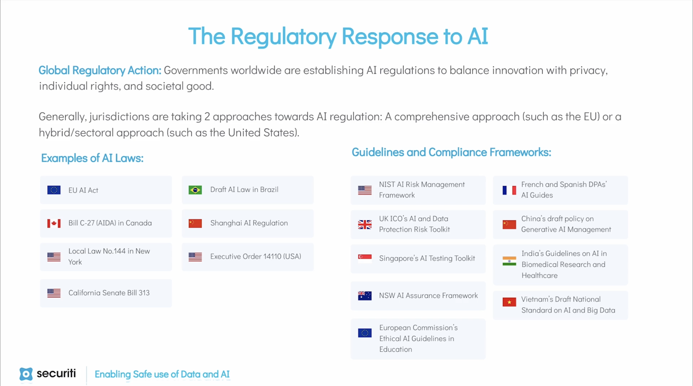

# Regulatory Responses to AI

> **Retrived on**: 2026-01-07 by Keming He from [Securiti - AI Security & Governance Certification - Module 8 - The Regulatory Response to AI](https://education.securiti.ai/certifications/ai-governance/ai-regulatory-compliance/the-regulatory-response-to-artificial-intelligence/)

## Overview

With the widespread adoption of AI models and systems in the business and commercial sectors, and the rapid evolution of their capabilities and applications, governments and legislators worldwide are taking swift action to establish regulatory controls on the use of AI. These measures aim to identify, mitigate, and oversee privacy and related risks associated with AI models and systems before they can cause significant harm to individuals.

This proactive global response to AI is characterized by a concerted effort to strike a delicate balance between technological innovation, business potential, individual rights, and the broader societal good.

> 
>
> Figure 1. Examples of AI laws, guidelines, and compliance frameworks by governments worldwide, labeled by country and type

## Comprehensive Legislation Approach

### European Union

Similar to the groundbreaking [General Data Protection Regulation (GDPR)](https://securiti.ai/what-is-gdpr/) that revolutionized data privacy, the European Union (EU) is once again at the forefront of regulatory efforts, this time addressing the burgeoning field of artificial intelligence (AI) through the transformative [AI Act](https://artificialintelligenceact.eu/the-act/).

The scope of the AI Act extends not only to the entities involved in developing and deploying AI within the EU but also to third-country providers and deployers placing AI systems on the EU market.

Taking a risk-based approach, the AI Act classifies different AI systems based on their intended purpose. It prohibits specific AI use cases while outlining comprehensive regulatory checks for other AI systems which it deems to be involved in activities that pose a significantly high risk of harm to health, safety, or fundamental rights of natural persons.

In addition, there are also specific regulatory requirements for general-purpose AI systems and AI systems intended to directly interact with natural persons or that synthetically generate or manipulate text, audio, image or video.

Nearly three years after its proposal, the landmark AI Act was approved by the European Parliament on March 13, 2024. The law will take effect 20 days after its publication in the Official Journal of the EU.

### Canada

In June 2022, the Government of Canada tabled the landmark Artificial Intelligence and Data Act (AIDA) as part of the omnibus [Bill C-27](https://www.parl.ca/DocumentViewer/en/44-1/bill/C-27/first-reading), Digital Charter Implementation Act 2022. The AIDA aims to set out new measures to regulate international and inter-provincial trade and commerce in AI systems and establish common requirements for the design, development, and use of AI systems in Canada. For help on understanding AIDA, see the [official companion document](https://ised-isde.canada.ca/site/innovation-better-canada/en/artificial-intelligence-and-data-act-aida-companion-document).

### Brazil

Introduced in the Brazilian Senate in May 2023, the [Bill of Law 2338/2023 (Bill 2338)](https://www25.senado.leg.br/web/atividade/materias/-/materia/157233) is currently under consideration by the legislature for a comprehensive regulatory framework for AI in Brazil. Just like the EU’s AI Act and Canada’s AIDA, Bill 2338 follows a risk-based approach providing for two risk levels for AI systems: Excessive risk and High risk.

## Hybrid/Sectoral Approach

### United States

The United States (US) has taken a multi-faceted approach for regulating the dynamic field of AI characterized by executive orders, advisory guidelines, and voluntary governance frameworks. In October 2023, the US federal government rolled out the landmark [Executive Order 14110](https://securiti.ai/blog/white-house-rolls-out-a-landmark-ai-executive-order/) – Safe, Secure, and Trustworthy Development and Use of Artificial Intelligence – aimed at comprehensively regulating the use and development of AI in the US.

EO 14110 placed obligations on over 20 federal agencies to come up with strategic plans on responsible deployment and use of AI and AI-enabled technologies in their specific sectors.The federal agencies have also been at the forefront of AI regulation in the US issuing voluntary guidelines as well as binding regulations for their specific sectors, including the following:

- The US Department of Defence
  - [AI Principles: Recommendations on the Ethical Use of Artificial Intelligence](https://media.defense.gov/2019/Oct/31/2002204458/-1/-1/0/DIB_AI_PRINCIPLES_PRIMARY_DOCUMENT.PDF)
- The US Food and Drug Administration
  - [Artificial Intelligence/Machine Learning (AI/ML)-Based Software as a Medical Device (SaMD) Action Plan](https://www.fda.gov/medical-devices/software-medical-device-samd/artificial-intelligence-and-machine-learning-software-medical-device)
- The Department of Health & Human Services
  - [Trustworthy AI Playbook](https://www.hhs.gov/sites/default/files/hhs-trustworthy-ai-playbook.pdf)

And more.

In addition, some US states have also come up with new laws to govern the use of AI within their jurisdictions and others are in process of enacting such laws. Following are some of the state laws on AI:

- State of Illinois
  - [Artificial Intelligence Video Interview Act](https://www.ilga.gov/legislation/ilcs/ilcs3.asp?ActID=4015&ChapAct=820%A0ILCS%A042/&ChapterID=68&ChapterName=EMPLOYMENT&ActName=Artificial%20Intelligence%20Video%20Interview%20Act.)
- State of New York
  - [New York City’s Law on Automated Employment Decision Tools](https://legistar.council.nyc.gov/LegislationDetail.aspx?ID=4344524&GUID=B051915D-A9AC-451E-81F8-6596032FA3F9)
- State of California
  - [San Jose’s Generative AI Guidelines](https://www.sanjoseca.gov/home/showpublisheddocument/100095/638255600904303329)

### China

China is one of the first countries to come up with AI-specific regulations. Similar to the US in many aspects, China also follows a mixed approach for AI regulation consisting of country-wide AI regulatory measures, regulations for specific regions, and advisory guidelines. Following are some of the significant AI regulatory measures taken by China so far:

- [A Next Generation Artificial Intelligence Development Plan](https://digichina.stanford.edu/work/full-translation-chinas-new-generation-artificial-intelligence-development-plan-2017/)
- [Code of Ethics for New-Generation Artificial Intelligence](http://www.most.gov.cn/kjbgz/202109/t20210926_177063.html)
- [Internet Information Service Algorithmic Recommendation Management Provisions](https://digichina.stanford.edu/work/translation-internet-information-service-algorithmic-recommendation-management-provisions-effective-march-1-2022/)

And more.
